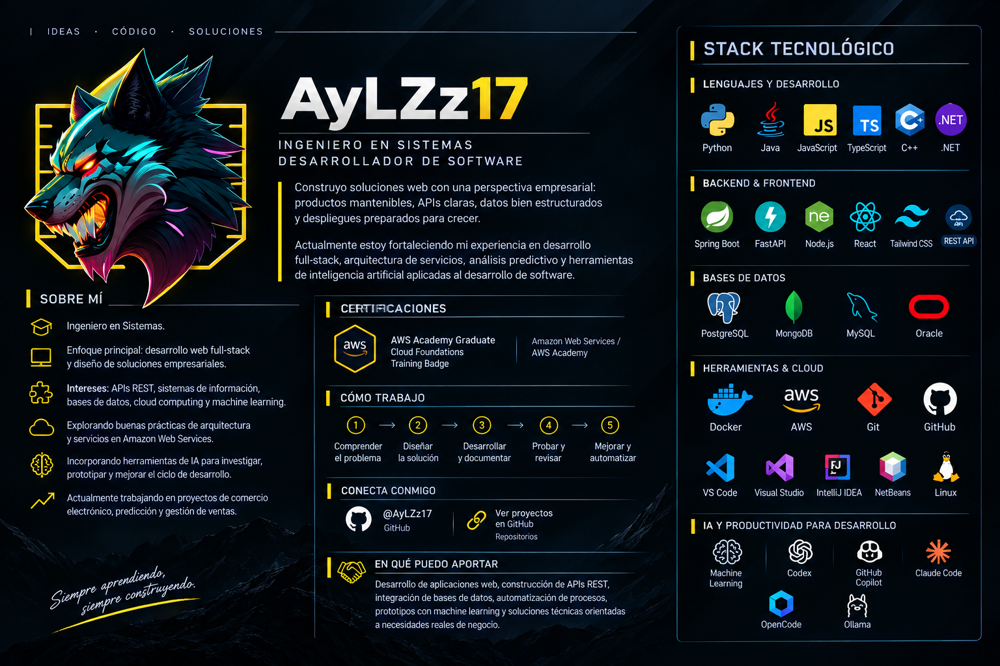

# AyLZz17

### Ingeniero en Sistemas · Desarrollador de Software

Desarrollo soluciones web y APIs con enfoque empresarial, combinando arquitectura, datos, cloud y machine learning.

[GitHub](https://github.com/AyLZz17) · [Repositorios](https://github.com/AyLZz17?tab=repositories) · [📧 aylz.contact@gmail.com](mailto:aylz.contact@gmail.com)

## Stack tecnológico

### Lenguajes

### Backend y frontend

### Datos, cloud y herramientas

Tecnologías adicionales: REST API, DBeaver, Apache NetBeans, Machine Learning, Codex, GitHub Copilot, Claude Code, OpenCode y Ollama.

## Proyectos

| Proyecto | Descripción |
| --- | --- |
| [Sistema de Predicción Crypto - XMR Monero](https://github.com/AyLZz17/SistemaPrediccionCrypto-XMRMonero) | Análisis y predicción de datos relacionados con Monero. |
| [Mai Repostería](https://github.com/AyLZz17/Mai-Reposteria-WebProject) | Aplicación web para una marca de repostería. |
| [Ventas de Instrumentos Musicales](https://github.com/AyLZz17/VentasInstrumentos-Musicales) | Solución web para gestión y comercialización de instrumentos. |

### Lenguajes en proyectos activos

### Stats

Siempre aprendiendo, construyendo y mejorando soluciones digitales.

